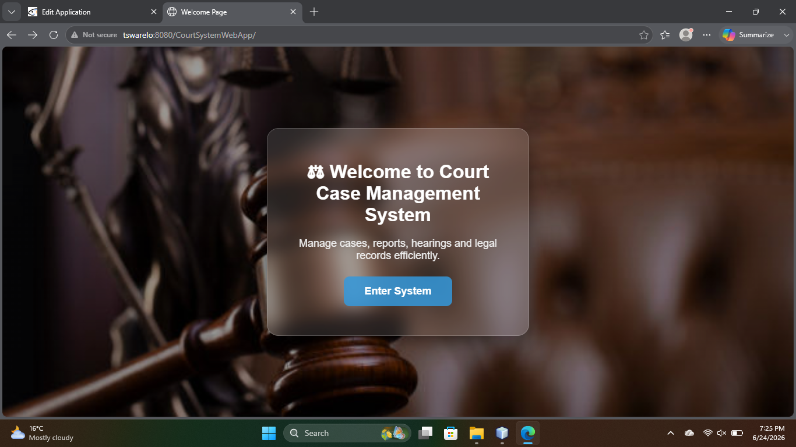
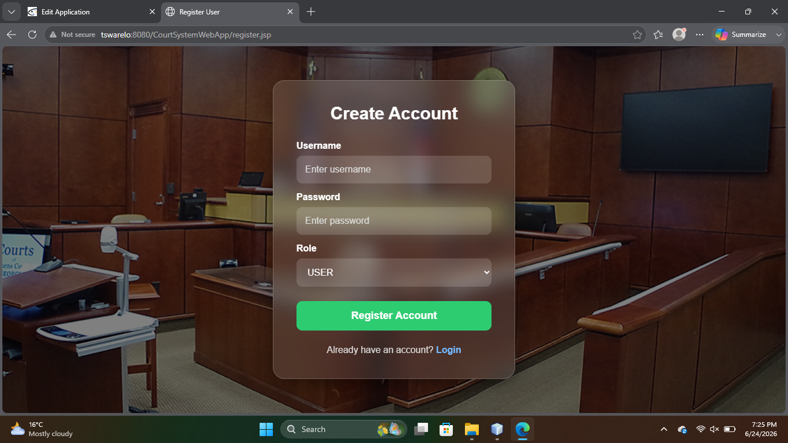
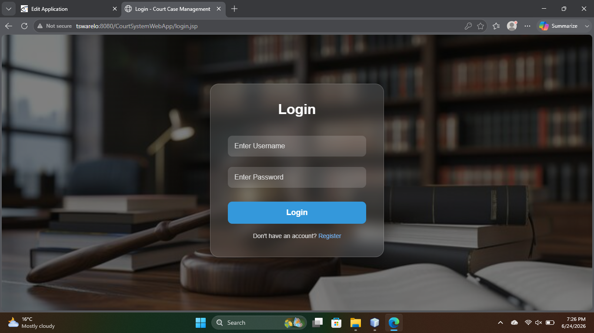
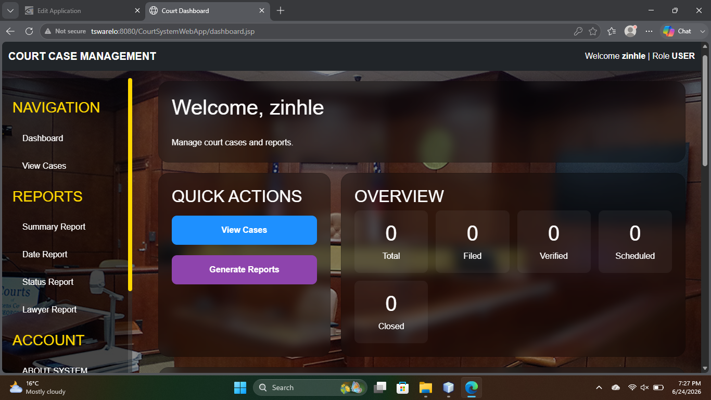
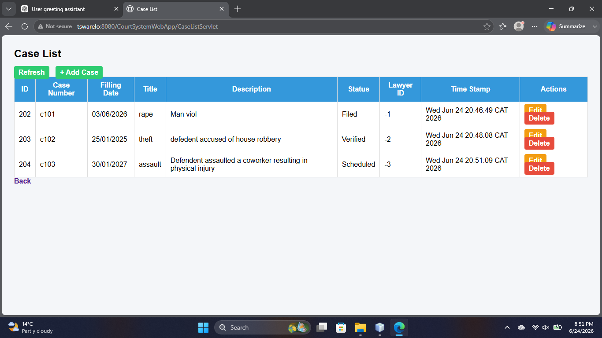
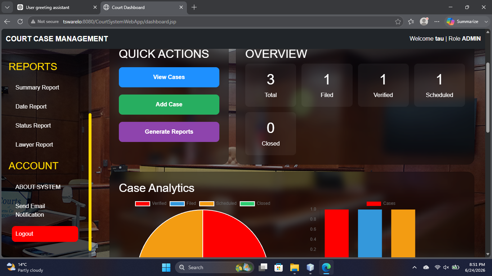
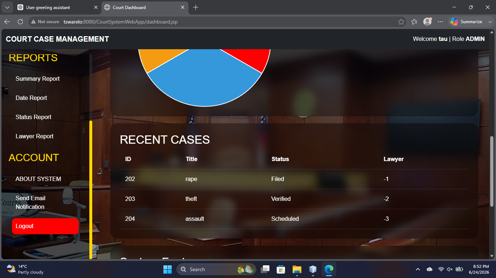
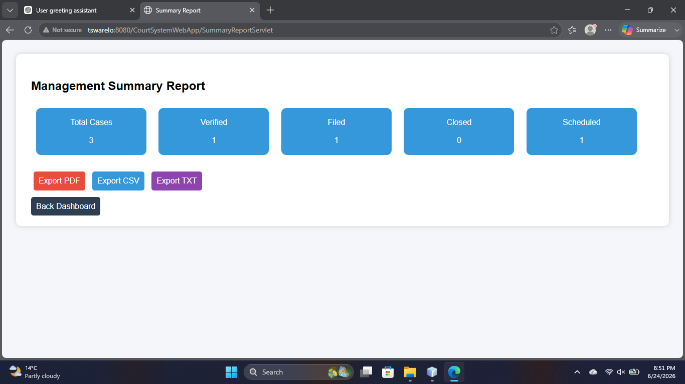
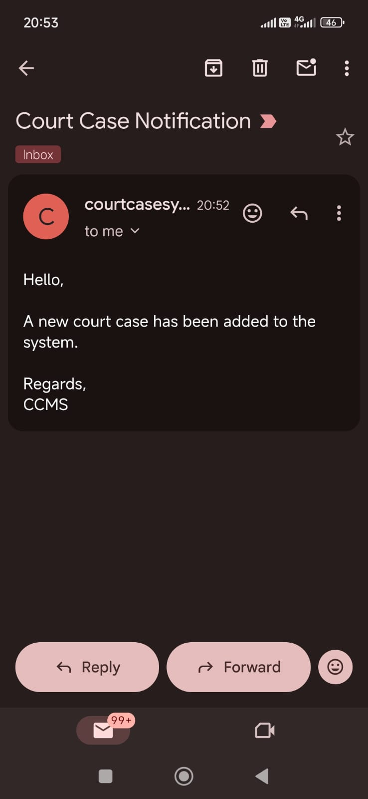

##Project Description
The Court Case Management System (CCMS) is a group web development project designed to digitize and streamline court case processes. 
It provides a centralized platform for managing the full lifecycle of court cases, including filing, verification, scheduling, hearings, judgment recording, and archiving.
The system improves efficiency, transparency, and communication between court stakeholders such as lawyers, court clerks, judges, administrators, and litigants.
It also ensures secure, role-based access to case information and automates key processes like case registration and report generation.
This project demonstrates the application of software engineering principles in designing and implementing a real-world judicial management system.

## Project Objective
The objective of this group project is to develop a system that improves efficiency, reduces paperwork, and enhances communication between court stakeholders by automating the court case lifecycle.

##System Users
Lawyers
Court Clerks
Judges
Court Administrators
Litigants / Defendants

##Technologies Used
Java (Web Application)
JSP / Servlets
MySQL Database
HTML, CSS
sprinboot 
glassfish

##Key Features
Case filing and registration
Document verification
Hearing scheduling
Judge and courtroom assignment
Judgment recording
Case status tracking
Report generation
Case archiving

##Security
Role-based access control
Secure login system
Data validation and protection

##System OverView(ScreenShorts)

